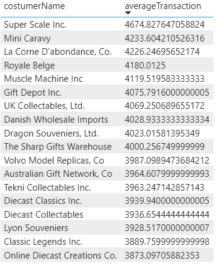
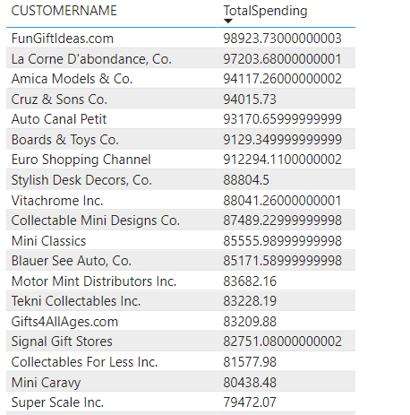
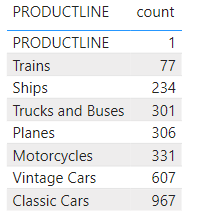
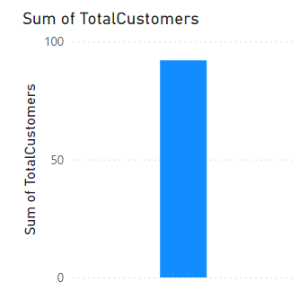
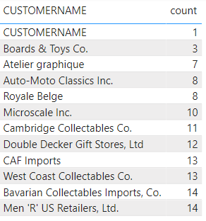
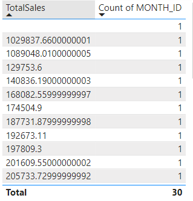
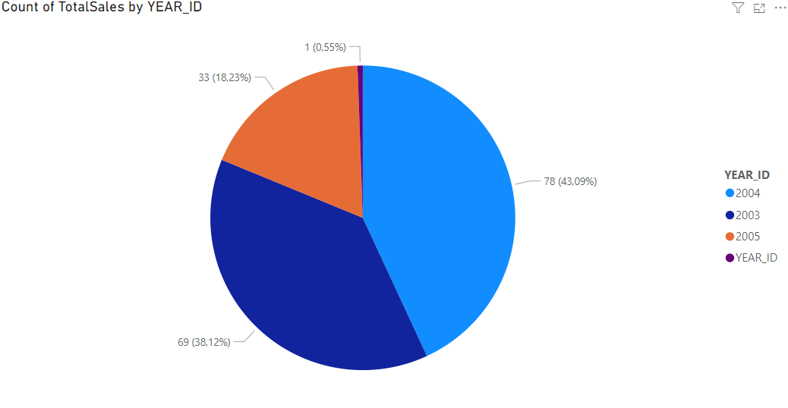

# Sales Data Analysis and Visualization

## Overview
This project involves analyzing sales data using Apache Spark and visualizing the results with Power BI. The main tasks include data preprocessing, performing aggregations, and creating insightful visualizations.

## Steps and Workflow

1. **Data Loading:**
   - Loaded sales data from a CSV file into a Spark DataFrame.

2. **Data Analysis with PySpark:**
   - Calculated the total number of unique customers.
   - Determined the average transaction amount for each customer.
   - Analyzed transaction frequencies.
   - Identified high-value customers based on their total spending.
   - Investigated transaction patterns over time.
   - Determined popular products and analyzed revenue trends over time.

3. **Data Export:**
   - Converted the Spark DataFrames to Pandas DataFrames.
   - Saved the data as CSV files.

4. **Data Visualization with Power BI:**
   - Imported the CSV files into Power BI.
   - Created table visualizations to display the analyzed data due to issues with aggregation in bar charts.

## Files

- `sales_data_sample.csv`: The raw sales data.
- `total_customers.csv`: Data on the total number of unique customers.
- `average_transaction_amount.csv`: Average transaction amount per customer.
- `transaction_frequencies.csv`: Frequency of transactions per customer.
- `high_value_customers.csv`: High-value customers based on total spending.
- `transaction_patterns.csv`: Transaction patterns over time.
- `popular_products.csv`: Popular products based on purchase frequency.
- `revenue_trends.csv`: Revenue trends over time.
- `main.py`: The script for data analysis and CSV export.

## How to Run the Analysis

1. **Set Up the Environment:**
   - Ensure you have Apache Spark installed and configured.
   - Install necessary Python libraries: `pandas`, `pyspark`.

2. **Run the Analysis Script:**
   ```bash
   python main.py

## Load Data into Power BI:

1. **Import the generated CSV files into Power BI**
2. **Create visualizations to gain insights from the data**

## Screenshots of Visualizations

1. **Customer Name and Average Transaction Amount**  
   

2. **Customer Name and Total Spending**  
   

3. **Product Line and Count**  
   

4. **Sum of Total Customers**  
   

5. **Customer Name and Count**  
   

6. **Total Sales and Count of Month**  
   

7. **Count of Total Sales by Year ID**  
   


## Conclusion
This project demonstrates the use of Apache Spark for large-scale data analysis and Power BI for data visualization. Despite some challenges with visualizations, the table views effectively conveyed the key insights.