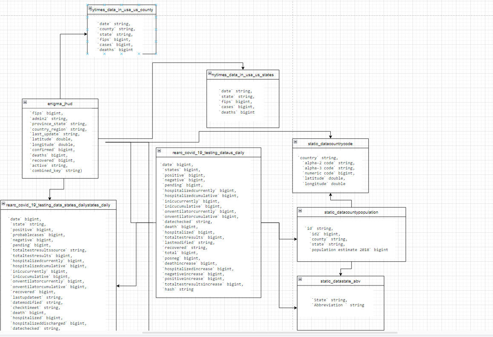
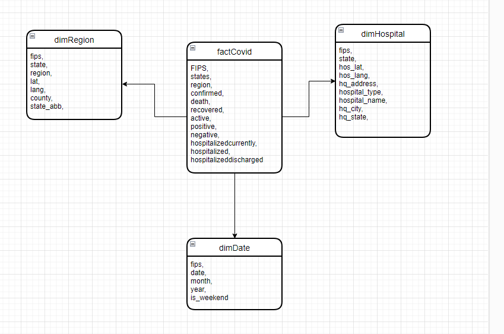

# AWS Glue ETL Job for COVID-19 Data Analysis

This project involves setting up an ETL pipeline using AWS Glue to process and analyze COVID-19 data stored in S3. The data includes various formats and required complex transformations and data modeling.

## Project Overview

### Objectives
- Utilize AWS Glue to create an ETL pipeline for processing diverse COVID-19 data formats from S3.
- Perform initial data analysis and transformation using Jupyter Notebook.
- Load transformed data into Amazon Redshift for further analysis.

### Tools and Services Used
- AWS Glue
- AWS S3
- Amazon Redshift
- Python (boto3, pandas, psycopg2)
- Jupyter Notebook

## Project Steps

### 1. Data Preparation and Initial Analysis
- Uploaded COVID-19 data in various formats (CSV, JSON, etc.) into an S3 bucket.
- Utilized Jupyter Notebook for initial data exploration, analysis, and preprocessing.

### 2. Setting Up AWS Glue Job
- Created an AWS Glue crawler to catalog the COVID-19 data stored in S3.
- Configured AWS Glue jobs to transform and load the cataloged data into Amazon Redshift.

### 3. Data Transformation and Loading into Redshift
- Developed and tested data transformation scripts using AWS Glue.
- Loaded transformed COVID-19 data into Amazon Redshift for centralized analysis.

### 4. Troubleshooting and Optimization
- Addressed challenges such as data format inconsistencies and schema mappings during transformation.
- Optimized AWS Glue jobs and Redshift queries for performance.

## first data model and dimensional model

some csv files were too big to upload so I deleted them like dimreigon

## Conclusion

This project provided hands-on experience with AWS Glue, S3, and Redshift for ETL and COVID-19 data analysis. By leveraging Jupyter Notebook for initial exploration and AWS Glue for scalable ETL processing, valuable insights were gained into effectively managing and analyzing large datasets.