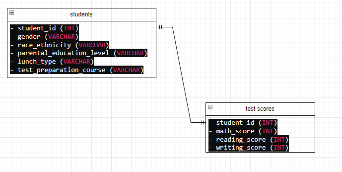
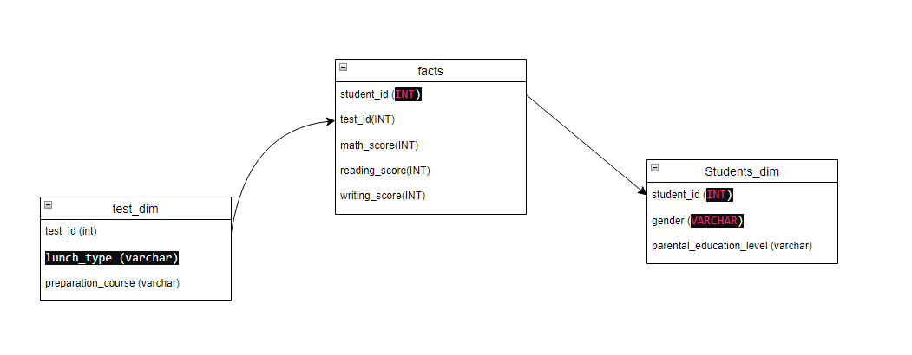

# Student Performance ETL Pipeline Project

## Project Overview

This project focuses on building an ETL pipeline to analyze student performance data. The pipeline extracts data from various sources, transforms it into a dimensional model, and loads it into Amazon Redshift for further analysis. Finally, AWS QuickSight is used for data visualization.

## Steps and Workflow

1. **Choose a Correct Data Set to Create Dimension Tables**
    - Identify and select a suitable dataset for analysis.

2. **Create Data Model**
    - Design an initial and dimensional data model to structure the data effectively.

3. **Connect to PostgreSQL**
    - Set up and connect to a PostgreSQL database for initial data storage and transformation.

4. **Data Loading into PostgreSQL**
    - Load the selected dataset into the PostgreSQL database.

5. **Put Data into S3**
    - Transfer the raw data from PostgreSQL to an S3 bucket.

6. **Create Dimension Tables**
    - Design and create dimension tables based on the data model.

7. **ETL and Transform Data into Redshift**
    - Extract data from S3, transform it according to the dimensional model, and load it into Amazon Redshift.

8. **Connect to S3 and Save Credentials**
    - Establish a secure connection to S3 and save the necessary credentials.

9. **Upload Data into S3**
    - Upload the transformed data into S3 for further processing.

10. **Create Redshift Workgroup**
    - Set up an Amazon Redshift workgroup for data warehousing and analysis.

11. **Create Tables According to Data Model**
    - Define and create tables in Amazon Redshift based on the dimensional data model.

12. **Transform Your DataFrame**
    - Apply necessary transformations to the DataFrame to match the schema of the Redshift tables.

13. **Connect to AWS Redshift**
    - Establish a connection to the Redshift cluster.

14. **Change Public Access**
    - Configure the Redshift cluster settings to enable public access.

15. **Write into Tables**
    - Load the transformed data into the Redshift tables.

16. **Analyze the Data with QuickSight**
    - Use AWS QuickSight to visualize and analyze the data.

### Data model

*Figure 1: Initial Data Model*

*Figure 2: Dimensional Data Model*

## Conclusion

This project demonstrates the end-to-end process of building an ETL pipeline, from data extraction to visualization. By leveraging AWS services such as S3, Redshift, and QuickSight, we efficiently transformed and analyzed student performance data.

## Notes

- Some scripts and files may not be available as the project was completed some time ago.
- The QuickSight visualizations are currently lost and unavailable.